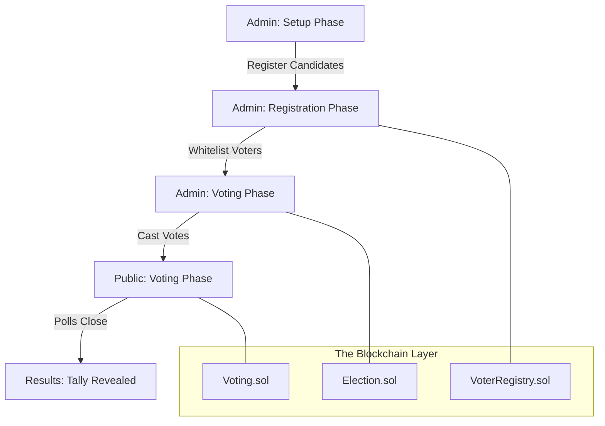

# 🗳️ VoteChain: The Future of Democracy

[](https://opensource.org/licenses/MIT)
[](https://hardhat.org/)
[](https://reactjs.org/)
[](https://ethereum.org/)

**VoteChain** is a production-grade, decentralized voting application that brings the unshakeable security of the Ethereum blockchain to the ballot box. No more "lost" votes, no more "tampered" results—just pure, mathematical transparency.

---

## 🌟 The "Layman's" Explanation
### *Imagine a locked glass box in the middle of the town square...*

In a traditional election, you drop a paper slip into a box, and someone take it behind closed doors to count it. You *hope* they count it right. You *hope* they don't lose the box.

**With VoteChain, it's different:**
1.  **The Box is Glass:** Everyone in the world can see the votes inside, but nobody can reach in and change them.
2.  **The Box is Locked by Math:** Instead of a physical lock, we use **Blockchain Technology**. Once a vote is cast, it is permanent. Not even the President or the Developer can delete it.
3.  **Your Key is Unique:** Only you have your digital "key" (your wallet). Once you've used it to vote once, the box remembers you and won't let you vote again.

**Result?** An election that is 100% fair, 100% transparent, and impossible to cheat.

---

## 🚀 The Creative Vision: "The Journey of a Vote"

> *"A vote is more than a choice; it's a digital fingerprint on the timeline of history."*

In VoteChain, the election isn't just an event—it's a **Living Organism** with a clear heartbeat:

1.  **The Setup (The Seed):** The Administrator plants the seed by naming the candidates and defining the rules. Execution is locked until the environment is perfectly prepared.
2.  **Registration (The Passport):** Voters apply for their "Digital Passport." The Admin verifies their right to vote, granting them entry into the cryptographic circle.
3.  **The Voting (The Choice):** The gates open. You cast your vote. Behind the scenes, a "Smart Contract" verifies your ID, checks if you've voted before, and records your choice on a globally distributed ledger.
4.  **The Tally (The Reveal):** Once the polls close, there is no manual counting. The math reveals the winner instantly. No recount needed—the blockchain is the final word.

---

## 🛠️ Technical Architecture & Creativity

### The "Brain" (Smart Contracts)
*   **`Election.sol`**: The Orchestrator. It manages the **State Machine** (Setup ➔ Registration ➔ Voting ➔ Results).
*   **`VoterRegistry.sol`**: The Gatekeeper. It maintains a secure mapping of whitelisted addresses, ensuring only authorized citizens can participate.
*   **`Voting.sol`**: The Vault. It handles the logic of vote casting, ensuring one-voter-one-vote and preventing any overflow or illegal entries.

### The "Nervous System" (Frontend)
Built with **React 18** and **ethers.js v6**, our UI isn't just a form—it's a real-time window into the blockchain.
*   **Glassmorphism Design**: Elegant, translucent interfaces that signify the transparency of the project.
*   **Recharts Integration**: Beautiful, dynamic bar charts that update as the consensus reaches the ledger.
*   **Robust Error Handling**: Custom middleware that decodes complex EVM errors into human-readable advice.

### 📊 System Workflow


---

## ⚡ Quick Start

### 1. Prerequisites
*   [Node.js](https://nodejs.org/) (v18+)
*   [MetaMask](https://metamask.io/) Extension
*   Hardhat node running locally

### 2. Installation & Setup
```bash
# Clone the repository
git clone https://github.com/YourUsername/votechain.git
cd votechain

# Install dependencies
npm install

# Start local blockchain
npx hardhat node

# Deploy & Seed initial data (In a new terminal)
npx hardhat run scripts/deploy.js --network localhost
npx hardhat run scripts/seed.js --network localhost
```

### 3. Launch the App
```bash
cd frontend
npm install
npm run dev
```

---

## 🛡️ Security Features
*   **OnlyAdmin Modifiers**: Critical functions like "Advance Phase" or "Add Candidate" are cryptographically locked to the owner's private key.
*   **Reentrancy Protection**: Safe coding patterns to prevent malicious contract interactions.
*   **Transparent Logging**: Every action emits an **Event**, searchable on Etherscan for auditing.

---

## 🤝 Contributing
Democracy is a collaborative effort! Feel free to fork, submit PRs, or open issues to make **VoteChain** even more secure.

---
*Built with ❤️ by the VoteChain Team.*
